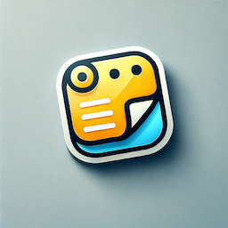

## **StickiNote – ESP32-P4 Digital Sticky Notes App**  

  

**StickiNote** is a **modern, e-paper-styled digital sticky note app** designed specifically for high-performance **ESP32-P4-based embedded systems**. This project leverages the **fast clock speed of the ESP32-P4** and the **MIPI DSI interface for a 10-inch display**, ensuring smooth animations, fluid UI interactions, and an optimal user experience.  

---

## **Features**  

**Designed for ESP32-P4** – Optimized for **ESP32-P4’s high-performance CPU and memory**.  
**MIPI DSI 10-Inch Display Support** – **Hardware-accelerated** rendering for large screens.  
**Digital Sticky Notes** – Add, move, resize, and edit post-its effortlessly.  
**Persistent Storage (NVS)** – Saves notes as JSON in ESP32's flash memory.  
**Animated Splash Screen** – Smooth startup animation for an engaging experience.  
**E-Paper-Like UI** – Minimalist notebook-style background.  
**Floating Action Button (FAB)** – Quickly create new sticky notes.  
**Keyboard Integration** – Pop-up keyboard for text input on sticky notes.  
**Touch & Drag Support** – Move and resize post-its with intuitive gestures.  
**Low Memory Consumption** – Optimized **LVGL v9 implementation** for high FPS.  

[](https://youtu.be/b1jTc1RyG3s)

*(Waveshare ESP32-P4 Nano & 10-Inch DSI Display)*

---

## **⚡ Why ESP32-P4 & MIPI DSI?**  

This project is designed **exclusively for ESP32-P4**, taking advantage of:  

**Higher Clock Speed** – Ensures smooth animations and fast UI updates.  
**MIPI DSI Interface** – Supports **10-inch high-resolution displays** with optimal performance.  
**Hardware Acceleration** – Optimized graphics rendering for fluid user interactions.  

⚠️ This project is **not** designed for standard ESP32 boards._ Using **ESP32-P4 is essential** to achieve the required performance levels.  

---

## **Getting Started**  

### **Requirements**  
- **ESP32-P4** (Fast clock + MIPI DSI support)  
- **10-inch MIPI DSI Display**  
- **ESP-IDF v5.3+**  
- **LVGL v9**  

---

## **Dependencies**  

This project requires the following **ESP-IDF components**:  

```yaml
dependencies:
  lvgl/lvgl:
    version: 9.2.*
    public: true
  waveshare/esp_lcd_jd9365_10_1: ^1.0.1
  waveshare/esp32_p4_nano: ^1.1.5
```

💡 **Ensure you have these dependencies installed in your ESP-IDF project before building.**  

---

## **How to Use**  

**Create a Note** – Tap the **FAB button** to create a sticky note.  
**Edit a Note** – Long-press on a note to open the **keyboard**.  
**Move a Note** – Drag and drop notes anywhere on the screen.  
**Resize a Note** – Tap the **corner triangle** and drag to resize.  
**Delete a Note** – Tap the `(X)` button inside a note.  
**Persistence** – All notes are saved automatically and restored on reboot.  

---

## **Project Structure**  

```
StickiNote/
│── main/
│   ├── include/                # header files
│   ├── main.cpp                # App entry point
│   ├── LVGL_WidgetManager.cpp  # Manages UI widgets
│   ├── SplashScreen.cpp        # Animated splash screen logic
│   ├── NVSManager.cpp          # Handles saving/loading notes in NVS
│   ├── ui_resources/           # UI assets (icons, images, fonts)
│   ├── CMakeLists.txt          # Build configuration
│── CMakeLists.txt              # Project build file
│── README.md                   # Documentation
│── LICENSE                     # Open-source license (MIT recommended)
```

---

## **Contributing**  

**Fork the repo** and submit pull requests with new features or bug fixes.  
**Report issues** via the [GitHub Issues](https://github.com/0015/StickiNote/issues) tab.  
**Feature Requests** – Suggest improvements via discussions!  

---

## **License**  

This project is **open-source** under the **MIT License**. Feel free to use, modify, and distribute it!  

---

## **Support & Community**  

💬 Have questions or ideas? Join our discussions!  
📢 **Follow us on [YouTube](https://youtube.com/ThatProject) for tutorials!**  